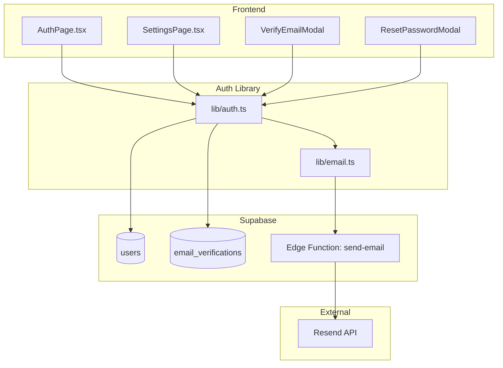
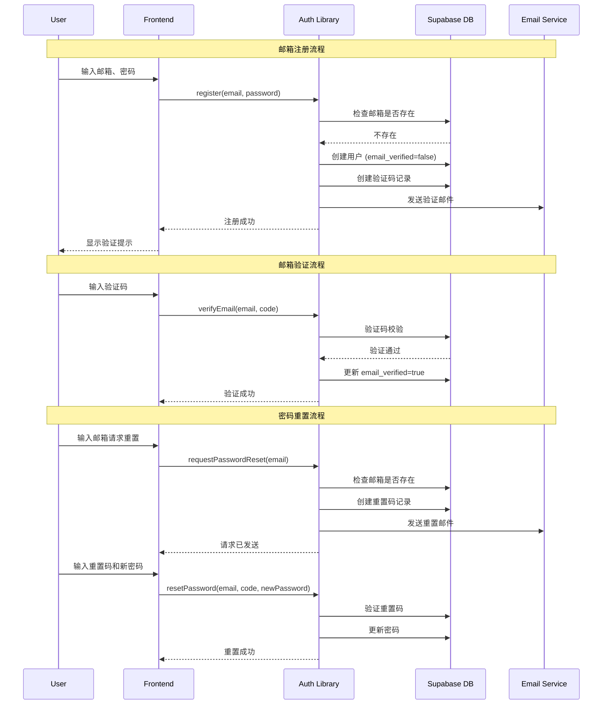
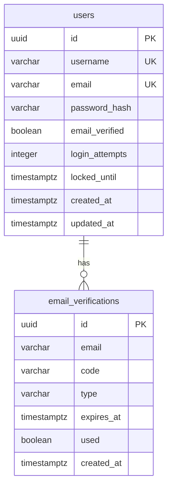

# Design Document

## Overview

本设计文档描述了 Lumina 应用邮箱认证系统的技术实现方案。系统将在现有用户名认证基础上扩展，添加邮箱注册、登录、验证和密码重置功能。设计遵循渐进式增强原则，确保向后兼容性。

## Architecture

### 系统架构图



### 认证流程图



## Components and Interfaces

### 1. Auth Library 扩展 (lib/auth.ts)

```typescript
// 扩展 User 接口
export interface User {
  id: string;
  username: string;
  email: string | null;
  email_verified: boolean;
  created_at: string;
}

// 新增函数
export async function registerWithEmail(email: string, password: string, username?: string): Promise<User>;
export async function loginWithEmail(emailOrUsername: string, password: string): Promise<User>;
export async function requestEmailVerification(email: string): Promise<void>;
export async function verifyEmail(email: string, code: string): Promise<void>;
export async function requestPasswordReset(email: string): Promise<void>;
export async function resetPassword(email: string, code: string, newPassword: string): Promise<void>;
export async function updateEmail(userId: string, newEmail: string, password: string): Promise<void>;
export async function resendVerificationCode(email: string): Promise<void>;
```

### 2. Email Service (lib/email.ts + Supabase Edge Function)

邮件发送采用 Supabase Edge Function + Resend 方案：

```typescript
// lib/email.ts - 前端调用接口
export async function sendVerificationEmail(email: string, code: string): Promise<void> {
  const response = await fetch(`${SUPABASE_URL}/functions/v1/send-email`, {
    method: 'POST',
    headers: {
      'Content-Type': 'application/json',
      'Authorization': `Bearer ${SUPABASE_ANON_KEY}`,
    },
    body: JSON.stringify({
      type: 'verification',
      to: email,
      code: code,
    }),
  });
  if (!response.ok) throw new Error('发送邮件失败');
}

export async function sendPasswordResetEmail(email: string, code: string): Promise<void>;
export async function sendEmailChangeVerification(email: string, code: string): Promise<void>;
```

```typescript
// supabase/functions/send-email/index.ts - Edge Function
import { Resend } from 'resend';

const resend = new Resend(Deno.env.get('RESEND_API_KEY'));

Deno.serve(async (req) => {
  const { type, to, code } = await req.json();
  
  const templates = {
    verification: {
      subject: 'Lumina - 验证您的邮箱',
      html: `<p>您的验证码是：<strong>${code}</strong></p><p>验证码10分钟内有效。</p>`,
    },
    password_reset: {
      subject: 'Lumina - 重置密码',
      html: `<p>您的密码重置验证码是：<strong>${code}</strong></p><p>验证码10分钟内有效。</p>`,
    },
  };
  
  const template = templates[type];
  await resend.emails.send({
    from: 'Lumina <noreply@yourdomain.com>',
    to: [to],
    subject: template.subject,
    html: template.html,
  });
  
  return new Response(JSON.stringify({ success: true }));
});
```

**配置要求**：
1. 在 Resend 注册账号并获取 API Key
2. 在 Supabase Dashboard 设置 Edge Function 环境变量 `RESEND_API_KEY`
3. 部署 Edge Function: `supabase functions deploy send-email`

### 3. AuthPage 组件扩展

```typescript
type AuthMode = 'login' | 'register' | 'forgot-password' | 'verify-email' | 'reset-password';

interface AuthPageState {
  mode: AuthMode;
  email: string;
  username: string;
  password: string;
  confirmPassword: string;
  verificationCode: string;
  loading: boolean;
  countdown: number; // 验证码倒计时
}
```

### 4. SettingsPage 扩展

新增邮箱管理区域：
- 显示当前邮箱和验证状态
- 修改邮箱功能
- 重新发送验证邮件按钮

## Data Models

### 数据库表结构变更

#### users 表扩展

```sql
-- 添加邮箱相关字段
ALTER TABLE users ADD COLUMN IF NOT EXISTS email varchar(255) UNIQUE;
ALTER TABLE users ADD COLUMN IF NOT EXISTS email_verified boolean DEFAULT false;
ALTER TABLE users ADD COLUMN IF NOT EXISTS login_attempts integer DEFAULT 0;
ALTER TABLE users ADD COLUMN IF NOT EXISTS locked_until timestamptz;

-- 创建邮箱索引
CREATE INDEX IF NOT EXISTS idx_users_email ON users(email);
```

#### email_verifications 表（新建）

```sql
CREATE TABLE IF NOT EXISTS email_verifications (
  id uuid PRIMARY KEY DEFAULT gen_random_uuid(),
  email varchar(255) NOT NULL,
  code varchar(6) NOT NULL,
  type varchar(20) NOT NULL, -- 'registration', 'password_reset', 'email_change'
  expires_at timestamptz NOT NULL,
  used boolean DEFAULT false,
  created_at timestamptz DEFAULT now()
);

CREATE INDEX IF NOT EXISTS idx_email_verifications_email ON email_verifications(email);
CREATE INDEX IF NOT EXISTS idx_email_verifications_expires ON email_verifications(expires_at);
```

### 数据模型关系



## Correctness Properties

*A property is a characteristic or behavior that should hold true across all valid executions of a system-essentially, a formal statement about what the system should do. Properties serve as the bridge between human-readable specifications and machine-verifiable correctness guarantees.*


### Property 1: Registration-Login Round Trip

*For any* valid email and password combination, registering a new user and then logging in with the same credentials SHALL succeed and return the same user ID.

**Validates: Requirements 1.1, 2.1**

### Property 2: Duplicate Email Prevention

*For any* registered email address, attempting to register a new account with the same email SHALL fail with an appropriate error.

**Validates: Requirements 1.2**

### Property 3: Email Format Validation

*For any* string that does not match the email format pattern (xxx@xxx.xxx), the registration form SHALL reject it before submission.

**Validates: Requirements 1.3**

### Property 4: Password Length Validation

*For any* password shorter than 6 characters, registration and password reset SHALL fail with a validation error.

**Validates: Requirements 1.4, 4.6**

### Property 5: Password Hash Security

*For any* stored user, the password_hash field SHALL NOT equal the plain text password and SHALL be a valid SHA-256 hash format (64 hex characters).

**Validates: Requirements 1.6**

### Property 6: Credential Error Uniformity

*For any* login attempt with incorrect email OR incorrect password, the Auth_System SHALL return the same generic error message.

**Validates: Requirements 2.2**

### Property 7: Dual Identifier Login

*For any* user with both email and username set, login SHALL succeed using either identifier with the correct password.

**Validates: Requirements 2.3**

### Property 8: Unverified Email Login

*For any* user with email_verified=false, login with correct credentials SHALL still succeed.

**Validates: Requirements 2.5**

### Property 9: Verification Code Format

*For any* generated verification code, it SHALL be exactly 6 digits (000000-999999).

**Validates: Requirements 3.1, 4.1**

### Property 10: Verification Code Validation

*For any* valid verification code, submitting the correct code SHALL mark the email as verified. *For any* incorrect or expired code, verification SHALL fail with an error.

**Validates: Requirements 3.3, 3.4**

### Property 11: Verification Code Rate Limiting

*For any* email with a valid unexpired verification code, requesting a new code within 60 seconds SHALL be rejected.

**Validates: Requirements 3.6**

### Property 12: Password Reset Security

*For any* email (registered or not), requesting password reset SHALL return success without revealing whether the email exists.

**Validates: Requirements 4.2**

### Property 13: Password Reset Code Validation

*For any* valid reset code, submitting the correct code with a valid new password SHALL update the password and invalidate the code. *For any* incorrect or expired code, reset SHALL fail.

**Validates: Requirements 4.4, 4.5**

### Property 14: Password Change Requires Current Password

*For any* password change request, providing an incorrect current password SHALL fail with an error.

**Validates: Requirements 5.2**

### Property 15: Verification Code Randomness

*For any* set of N generated verification codes, the distribution SHALL be approximately uniform across the 000000-999999 range (no predictable patterns).

**Validates: Requirements 6.4**

## Error Handling

### Error Types and Messages

| Error Code | Message (Chinese) | Scenario |
|------------|-------------------|----------|
| `INVALID_EMAIL` | 请输入有效的邮箱地址 | Email format validation failed |
| `EMAIL_EXISTS` | 该邮箱已被注册 | Registration with existing email |
| `USERNAME_EXISTS` | 用户名已被使用 | Registration with existing username |
| `INVALID_CREDENTIALS` | 邮箱或密码错误 | Login with wrong email/password |
| `PASSWORD_TOO_SHORT` | 密码至少需要6位 | Password < 6 characters |
| `PASSWORDS_NOT_MATCH` | 两次密码不一致 | Confirm password mismatch |
| `INVALID_CODE` | 验证码错误或已过期 | Wrong/expired verification code |
| `RATE_LIMITED` | 请求过于频繁，请稍后再试 | Rate limit exceeded |
| `ACCOUNT_LOCKED` | 账户已被锁定，请稍后再试 | Too many failed login attempts |
| `EMAIL_NOT_VERIFIED` | 请先验证邮箱 | Action requires verified email |

### Error Handling Strategy

1. **Validation Errors**: Return immediately with specific field errors
2. **Authentication Errors**: Use generic messages to prevent enumeration
3. **Rate Limiting**: Return 429 status with retry-after information
4. **Server Errors**: Log details, return generic error to user

## Testing Strategy

### Unit Tests

1. **Email Validation**
   - Valid email formats
   - Invalid email formats (missing @, missing domain, etc.)

2. **Password Validation**
   - Minimum length enforcement
   - Hash generation and verification

3. **Verification Code**
   - Code generation (6 digits)
   - Code expiration logic
   - Code validation

### Property-Based Tests

Using a property-based testing library (e.g., fast-check for TypeScript):

1. **Registration-Login Round Trip** (Property 1)
   - Generate random valid emails and passwords
   - Register, then login, verify success

2. **Password Hash Security** (Property 5)
   - Generate random passwords
   - Verify hash is not equal to plain text
   - Verify hash format

3. **Dual Identifier Login** (Property 7)
   - Generate users with both email and username
   - Verify login works with either

4. **Verification Code Format** (Property 9)
   - Generate many codes
   - Verify all are 6 digits

5. **Credential Error Uniformity** (Property 6)
   - Test wrong email, wrong password
   - Verify same error message

### Integration Tests

1. **Full Registration Flow**
   - Register → Receive verification email → Verify → Login

2. **Password Reset Flow**
   - Request reset → Receive email → Reset password → Login with new password

3. **Rate Limiting**
   - Multiple failed logins → Account lock
   - Multiple code requests → Rate limit

## Code Change Impact Assessment

### Files to Modify

| File | Changes | Impact |
|------|---------|--------|
| `lib/auth.ts` | Add email auth functions, extend User interface | High - Core auth logic |
| `components/AuthPage.tsx` | Add email/forgot password modes, verification UI | High - Main auth UI |
| `components/SettingsPage.tsx` | Add email management section | Medium - Settings UI |
| `supabase/schema.sql` | Add email fields, new tables | High - Database schema |
| `types.ts` | Update User type if needed | Low - Type definitions |

### New Files to Create

| File | Purpose |
|------|---------|
| `lib/email.ts` | Email sending utilities (调用 Edge Function) |
| `supabase/functions/send-email/index.ts` | Supabase Edge Function 发送邮件 |
| `supabase/plus/007_add_email_auth.sql` | Migration for email auth |
| `shared/VerificationInput.tsx` | 6-digit code input component |

### Backward Compatibility

1. **Existing Users**: Will have `email=null`, `email_verified=false`
2. **Login**: Continue to support username-only login
3. **Registration**: Support both username-only and email registration
4. **Data Migration**: No data migration needed, new fields are nullable

### Risk Assessment

| Risk | Likelihood | Impact | Mitigation |
|------|------------|--------|------------|
| Email delivery failures | Medium | High | Implement retry logic, show manual verification option |
| Rate limiting too aggressive | Low | Medium | Make limits configurable, provide clear feedback |
| Existing user confusion | Low | Low | Clear UI messaging about optional email |
